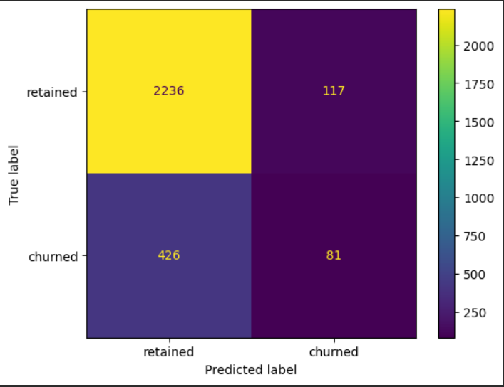
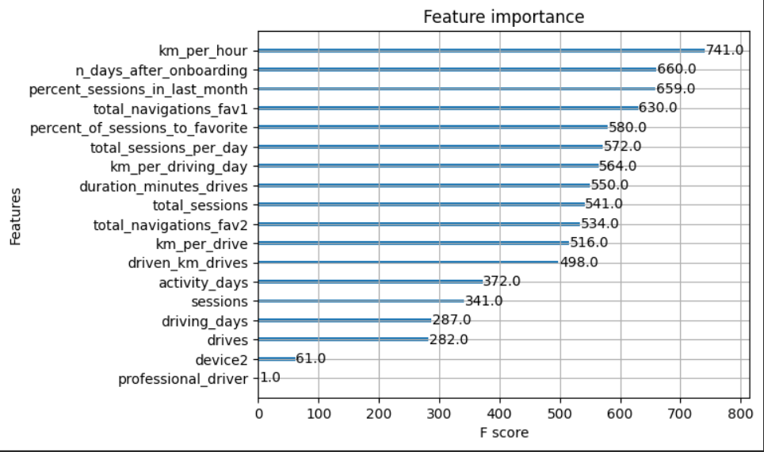

# Overview

The goal of this project is to predict monthly user churn for the Waze driving app (users who uninstall or stop using the app) and to identify the features that best separate churners from retained users. The analysis compares Random Forest and XGBoost classifiers trained on a number of collected and engineered features. The XGBoost model fit the data better than the Random Forest and achieves an improved recall, while maintaining similar accuracy and precision.

## Business Understanding

Churn directly reduces active-user counts and growth. The Waze stakeholders want a model that flags users at risk of churning so the product team can test retention interventions (targeted messaging, incentives, product improvements, etc.). The project aims to produce both a predictive model and actionable feature insights that inform product decisions and prioritization.

## Data

- Source & scope
Raw usage logs from the Waze app (session counts, drive summaries, timestamps, app interactions). Exact labels and extraction steps are documented in the jupyter notebook.

- Samples & features
The notebook builds several engineered features. Six engineered features appear among the top-10 most important onces for the targer: km_per_hour, percent_sessions_in_last_month, total_sessions_per_day, percent_of_drives_to_favorite, km_per_drive, km_per_driving_day.
These engineered aggregates substantially improved signal compared to raw columns.

### Preprocessing notes (in the notebook)

Splitting strategy: train / validation / test (a three-way split to allow honest model selection on the validation set and final estimate on the test set). 
Typical cleaning/feature-engineering steps: session aggregation, drive-level summarization, creation of percent/ratio features, categorical encodings, and handling of class imbalance (see notebook for methods explored and comments).

## Modeling and Evaluation

Models trained:
1) Random Forest (baseline ensemble)
2) XGBoost (final / champion model)
Both models were compared via the validation set and then evaluated on the held-out test set.

Why ensembles were chosen:
Tree ensembles require less heavy preprocessing than a logistic-regression. However, they are less interpretable, so feature engineering + model-agnostic interpretation tools were used to understand what matters most. The resulting classification is not great, but it is clerly better than what was found in simple regression models.

## Feature Importance / Key Drivers

Engineered features dominate the top-10 importance list (6 of the top 10). The single-most valuable signals come from km driven, session frequency, drives to favorite locations. It is advised to use these these as starting points for targeted product interventions.

## Conclusion and Limitations

Ensemble tree models (XGBoost) improved detection of churn over logistic regression (conducted earlier) and highlighted useful engineered features. However, current data is insufficient to consistently predict churn at high recall or precision. Richer drive-level data and more granular interaction information are likely required to reach actionable performance. Recommendations are to collect more detailed per-drive information (drive times, geo-locations, in-app interactions) and to re-examine thee analyses.
